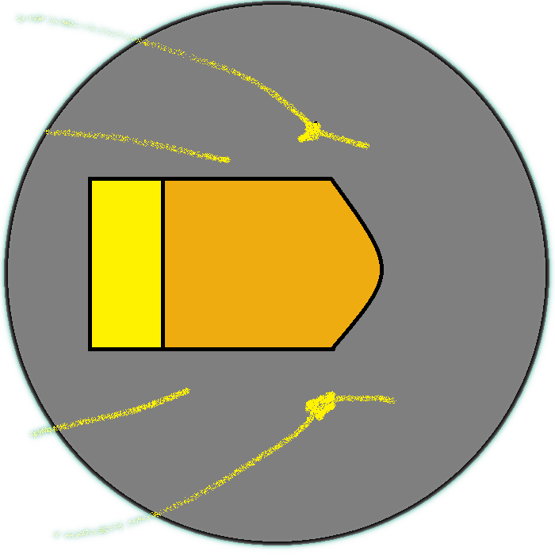

<h1>BulletProof</h1>
<h4>A game made with C++ and raylib</h4>
<h4>
BulletProof is a game where you're a bullet and have to avoid walls,       
But you only can move up and down. Also, walls have a little hole in them.     
You have to go from hole to get score.

Main rules
Press 'W' or 'KEY_UP' to move up.         \
Press 'S' or 'KEY_DOWN' to move down.      
Avoid brown areas to get score.                                              
 
</h4>

